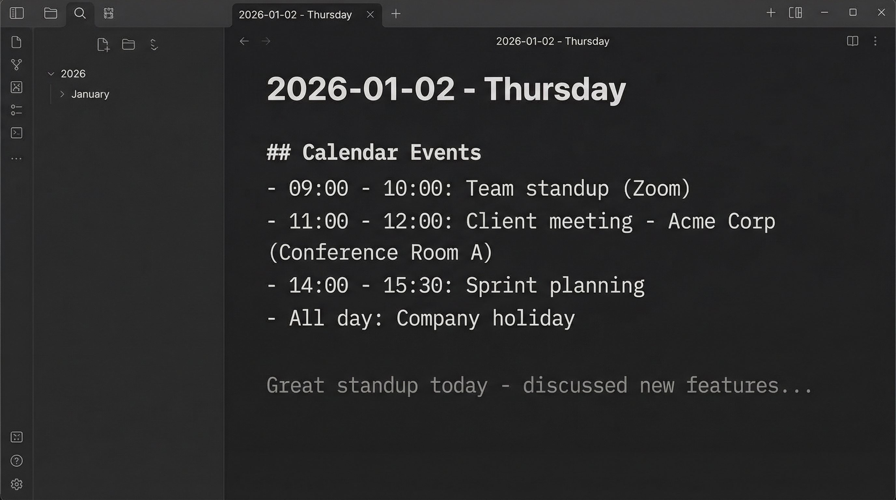
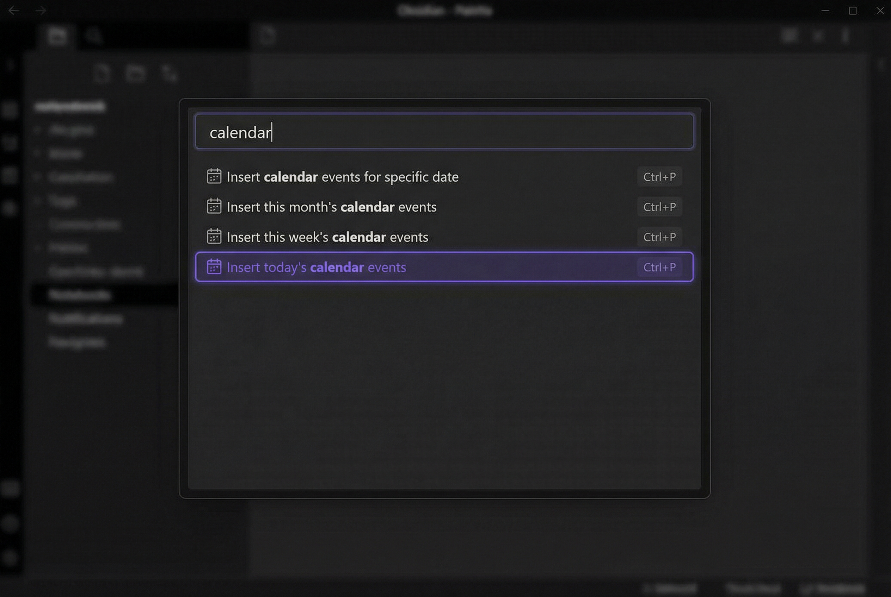
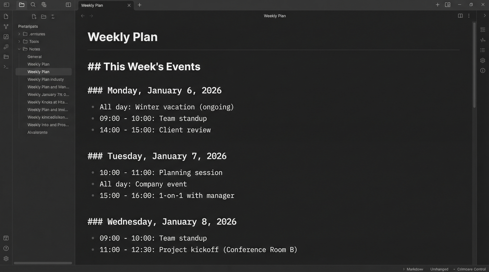
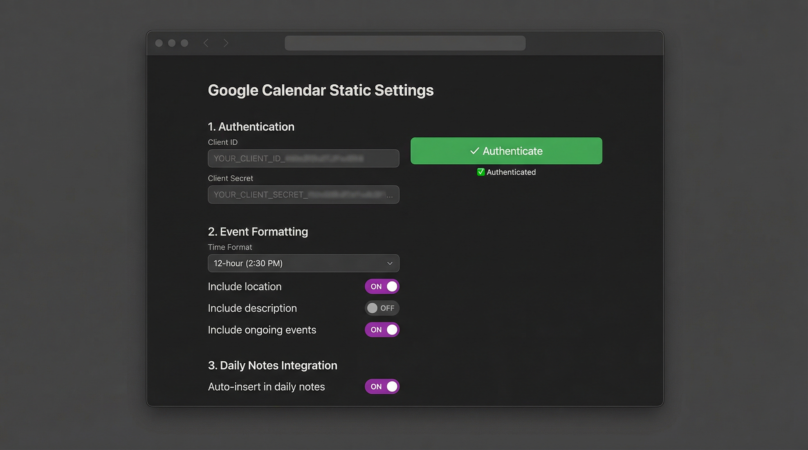

# Google Calendar Static

Insert Google Calendar events as **static text** into your Obsidian notes. Perfect for daily notes and journaling.



## Why This Plugin?

Unlike other calendar plugins that create dynamic embeds, **Google Calendar Static** inserts events as editable markdown text. This means:

- ✅ **Static content** - Events become permanent text in your notes
- ✏️ **Fully editable** - Modify, reorganize, or annotate events after insertion
- 🚀 **Fast** - No dynamic loading or rendering delays
- 📝 **Perfect for journaling** - Capture what you did, then add reflections

## Features

- 📅 **Insert Today's Events** - Quick command to add today's calendar
- 🗓️ **Insert Events for Any Date** - Choose a specific date with date picker
- 📆 **Insert This Week's Events** - Get all events for the current week (Monday-Sunday)
- 📊 **Insert This Month's Events** - Get all events for the current month
- 🤖 **Auto-insert in Daily Notes** - Automatically add events when opening daily notes
- ⚙️ **Customizable Formatting** - Control time format (12h/24h), include/exclude locations and descriptions
- 🔐 **Secure OAuth** - Direct authentication with Google (no third-party services)



## Installation

### From Obsidian Community Plugins (Recommended)

1. Open Settings → Community Plugins
2. Disable Safe Mode
3. Browse plugins and search for "Google Calendar Static"
4. Install and enable the plugin

### Manual Installation

1. Download `main.js`, `manifest.json`, and `styles.css` from the [latest release](https://github.com/yourusername/google-calendar-static/releases)
2. Create folder: `VaultFolder/.obsidian/plugins/google-calendar-static/`
3. Copy files into the folder
4. Reload Obsidian and enable the plugin

## Setup

### 1. Create Google Cloud Project

1. Go to [Google Cloud Console](https://console.cloud.google.com/)
2. Create a new project (or select existing)
3. Enable the **Google Calendar API**:
   - Go to "APIs & Services" → "Library"
   - Search for "Google Calendar API"
   - Click "Enable"

### 2. Configure OAuth Consent Screen

1. Go to "APIs & Services" → "OAuth consent screen"
2. Choose "External" user type
3. Fill in required fields:
   - **App name**: "Obsidian Calendar" (or your choice)
   - **User support email**: Your email
   - **Developer contact**: Your email
4. Add scope: `https://www.googleapis.com/auth/calendar.readonly`
5. Add yourself as a test user

### 3. Create OAuth Credentials

1. Go to "APIs & Services" → "Credentials"
2. Click "+ CREATE CREDENTIALS" → "OAuth client ID"
3. Application type: **"Web application"**
4. Name: "Obsidian Plugin"
5. Add **Authorized JavaScript origins**:
   - `http://localhost:8080`
6. Add **Authorized redirect URIs**:
   - `http://localhost:8080/callback`
7. Click "CREATE"
8. Copy your **Client ID** and **Client Secret**

### 4. Configure Plugin

1. Open Obsidian Settings → Google Calendar Static
2. Paste your Client ID
3. Paste your Client Secret
4. Click "Authenticate"
5. Complete authentication in your browser
6. Return to Obsidian - you're ready!

## Usage

### Insert Today's Events

1. Open any note
2. Run command: "Insert today's calendar events" (Ctrl/Cmd+P)
3. Events are inserted as text at your cursor

**Example output:**
```markdown
## Calendar Events

- 09:00 - 10:00: Team standup (Zoom)
- 11:00 - 12:00: Client meeting - Acme Corp (Conference Room A)
- All day: Company holiday
```

### Insert Events for Specific Date

1. Run command: "Insert calendar events for specific date"
2. Choose date in the picker
3. Events for that date are inserted

### Insert This Week's Events

1. Run command: "Insert this week's calendar events"
2. All events for Monday-Sunday are inserted, grouped by day



**Example output:**
```markdown
## This Week's Events

### Monday, January 6, 2026

- All day: Winter vacation (ongoing)
- 09:00 - 10:00: Team standup
- 14:00 - 15:00: Client review

### Tuesday, January 7, 2026

- 10:00 - 11:00: Planning session
- All day: Company event
```

*Note: "Winter vacation (ongoing)" started before this week but extends into it.*

### Insert This Month's Events

1. Run command: "Insert this month's calendar events"
2. All events for the current month are inserted, grouped by day

### Auto-insert in Daily Notes

1. Go to Settings → Google Calendar Static
2. Enable "Auto-insert in daily notes"
3. Events are automatically added when you **create new** daily notes
4. Works with filenames like `2026-01-02.md` or `2026-01-02 - Title.md`
5. **Note:** Only triggers for newly created notes, not when opening existing ones

## Settings



### Time Format
- **12-hour** (2:30 PM) or **24-hour** (14:30)

### Include Location
- Show event location in parentheses

### Include Description
- Add event description below the event

### Include Ongoing Events
- Show multi-day events that started before but extend into the requested period
- Example: A vacation from Dec 28 - Jan 5 will show on Jan 1 when viewing January events
- These events are marked with "(ongoing)" indicator
- Default: Enabled

### Auto-insert in Daily Notes
- Automatically insert events when opening daily notes

## Privacy & Security

- 🔒 **OAuth 2.0** - Industry-standard secure authentication
- 🏠 **Local storage** - All tokens stored locally in Obsidian
- 👁️ **Read-only access** - Plugin only reads calendar events
- 🚫 **No tracking** - No analytics or data collection
- 🔌 **Direct connection** - Connects directly to Google (no middleman)

## Troubleshooting

### "redirect_uri_mismatch" Error

Make sure you added `http://localhost:8080/callback` to **Authorized redirect URIs** in Google Cloud Console. Port must be exactly **8080**.

### Authentication Fails

1. Verify Client ID and Secret are correct (no extra spaces)
2. Make sure you're logged in as a test user
3. Check that Google Calendar API is enabled
4. Try re-creating OAuth credentials

### No Events Showing

1. Check that you have events in your Google Calendar for that date
2. Verify you're authenticated (check settings)
3. Try re-authenticating
4. Check console for errors (Ctrl/Cmd+Shift+I)

### Port 8080 Already in Use

Close any apps using port 8080, or restart your computer.

## Development

### Prerequisites

- Node.js v16 or later
- npm

### Build from Source

```bash
# Clone the repository
git clone https://github.com/yourusername/google-calendar-static.git
cd google-calendar-static

# Install dependencies
npm install

# Development build (watch mode)
npm run dev

# Production build
npm run build
```

### Project Structure

```
google-calendar-static/
├── main.ts              # Plugin entry point
├── settings.ts          # Settings interface and UI
├── googleCalendar.ts    # Google Calendar API wrapper
├── oauthServer.ts       # OAuth 2.0 authentication
├── formatter.ts         # Event formatting logic
├── dateModal.ts         # Date picker modal
├── manifest.json        # Plugin metadata
└── package.json         # Dependencies
```

## Security

This plugin handles OAuth tokens and calendar data. Please review the [Security Policy](SECURITY.md) for important information about:
- Token storage and security
- Known limitations
- Best practices
- Reporting vulnerabilities

## Contributing

Contributions are welcome! Please read [CONTRIBUTING.md](CONTRIBUTING.md) for important information:

**⚠️ This is a use-at-your-risk project with no guarantees**
- I make no guarantees about fixing issues or accepting PRs
- Response times are not guaranteed
- Submit issues on GitHub for bugs and feature requests
- See CONTRIBUTING.md for guidelines

Quick steps:
1. Fork the repository
2. Create a feature branch (`git checkout -b feature/amazing-feature`)
3. Commit your changes (`git commit -m 'Add amazing feature'`)
4. Push to branch (`git push origin feature/amazing-feature`)
5. Open a Pull Request

## License

MIT License - see [LICENSE](LICENSE) file

## Support

- 🐛 [Report bugs](https://github.com/yourusername/google-calendar-static/issues)
- 💡 [Request features](https://github.com/yourusername/google-calendar-static/issues)
- ⭐ Star the repo if you find it useful!

## Acknowledgments

Built with:
- [Obsidian API](https://github.com/obsidianmd/obsidian-api)
- [Google APIs Node.js Client](https://github.com/googleapis/google-api-nodejs-client)

---

**Made with ❤️ for the Obsidian community**
